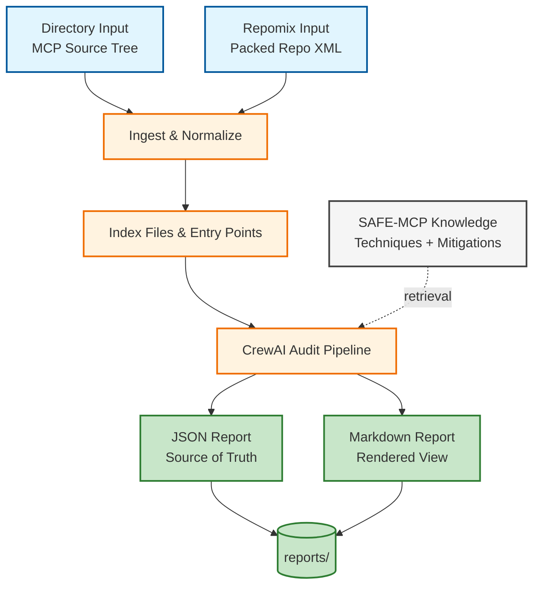
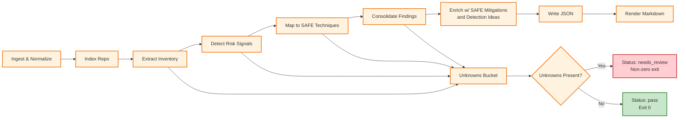
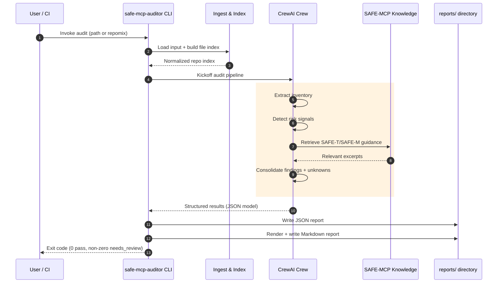

<!-- markdownlint-disable MD013 -->

# PRD: SAFE-MCP Auditor (CrewAI)

## Summary

Build a read-only auditing application that analyzes a Model Context Protocol (MCP) server codebase and produces a standardized security audit report mapped to the SAFE-MCP framework.

The primary output is an engineer-friendly backlog of actionable findings, paired with an appendix that shows SAFE-MCP technique coverage.

Deliverables per run:

- `reports/<target-name>-<input-hash>-safe-mcp-audit.md`
- `reports/<target-name>-<input-hash>-safe-mcp-audit.json`

Where:

- `<target-name>` is derived automatically (with override).
- `<input-hash>` is a short, stable fingerprint of the analyzed input to avoid overwriting and to support comparisons over time.

## Architecture diagrams

### System overview



### Audit pipeline (internal stages)



### Run sequence (CLI → audit → reports)



## Background

MCP servers can expose powerful tools (filesystem, network, credentials, package managers, CI/CD systems). SAFE-MCP provides a MITRE ATT&CK-style catalog of tactics, techniques, and mitigations tailored to MCP ecosystems.

Security reviewers and engineers need a repeatable way to:

- Inventory what an MCP server can do.
- Identify security risks and map them to SAFE-MCP techniques.
- Recommend mitigations and detections grounded in SAFE-MCP.
- Produce a consistent report artifact suitable for CI and diffing.

## Goals

- Accept MCP code as either:
  - a local directory containing the MCP server source, or
  - a Repomix “packed repo” file (XML).
- Perform read-only static analysis (no code execution).
- Produce a standardized, engineer-first report:
  - prioritized findings with evidence and excerpts,
  - explicit unknowns that block confidence,
  - SAFE-MCP technique coverage appendix.
- Output a machine-readable JSON report suitable for CI automation.
- Make audit runs reproducible and debuggable.

## Non-goals

- Dynamic testing, fuzzing, or running the MCP server.
- Verifying runtime environment, infrastructure, or deployment configuration not present in the repository.
- Connecting to external MCP servers to “probe” tool behavior.
- Remediation PR generation (may be a future enhancement).

## Users and personas

- Software engineers maintaining an MCP server.
- Security engineers reviewing an MCP server.
- OSS maintainers auditing MCP servers from the internet.

Primary persona: engineers who need actionable fixes.

## User stories

- As an engineer, I can run the auditor against a repo directory and get a prioritized list of findings with file/line evidence and excerpts.
- As an engineer, I can run the auditor against a Repomix XML and get the same report format.
- As an engineer, I can diff JSON reports over time to track regressions.
- As an engineer, I see an explicit “needs review” status when the auditor cannot prove key properties.

## Key decisions (locked)

- Outputs: Markdown + JSON.
- Include raw excerpts in reports.
- Stable finding IDs.
- Unknowns are a non-passing gate.
- Engineer-first report ordering.

## Technology choices

### Python dependency management (uv)

This project uses `uv` for all Python dependency and environment management.

- Dependencies are declared in `pyproject.toml`.
- The project uses a committed `uv.lock` to ensure reproducible installs.
- `uv` manages the project virtual environment under `.venv`.
- Developer workflows should prefer `uv run ...` to guarantee commands run in a locked environment (keeps `pyproject.toml`, `uv.lock`, and `.venv` in sync).

Common workflows (illustrative):

- Initialize project: `uv init`
- Add/remove dependencies: `uv add ...`, `uv remove ...`
- Update lockfile: `uv lock`
- Sync environment from lockfile: `uv sync`

References:

- `https://docs.astral.sh/uv/`
- `https://docs.astral.sh/uv/guides/projects/`

### CLI framework (Typer)

The auditor CLI is implemented with Typer to provide strong UX defaults and type-driven argument validation.

- Command groups and subcommands (e.g., `audit`, `version`, `schema`) map naturally to Typer apps.
- Automatic `--help` and optional shell completion improve discoverability.
- Type hints (e.g., `Path`, `Enum`) provide built-in validation and better error messages.

References:

- `https://typer.tiangolo.com/`
- `https://typer.tiangolo.com/tutorial/`

## Inputs

### Input types

1. Directory input
   - Path to a local folder containing the MCP server code.

2. Repomix input
   - Path to a Repomix XML file containing a packed repository.
   - The Repomix file is treated as read-only; any remediation would happen in the original source, not the packed file.

### Target naming

Target name is derived deterministically in this order:

1. CLI override: `--target-name` (slugified)
2. Directory input: directory basename (slugified)
3. Repomix input:
   - repo name or URL from Repomix metadata, if present (slugified)
   - otherwise Repomix filename basename (slugified)
4. Fallback: `unknown-target`

### Input fingerprint (hash)

Each run generates an `<input-hash>` used in the output filename.

Recommended approach:

- Directory mode: compute a stable hash of relative file paths included in scope plus file content hashes, ignoring excluded paths.
- Repomix mode: hash the Repomix file contents.

Use an 8- to 12-character prefix of a cryptographic hash.

## Output artifacts

### Output location

- All output is written under `reports/`.
- Reports are never overwritten unless explicitly requested.

### Output files

- `reports/<target-name>-<input-hash>-safe-mcp-audit.json`
- `reports/<target-name>-<input-hash>-safe-mcp-audit.md`

### Exit status

The CLI returns:

- `0` for `pass`
- non-zero for `needs_review` or `fail`

Unknowns always force a non-pass:

- If `unknowns[]` is non-empty: `status = needs_review` and exit non-zero.

## Report philosophy

- JSON is the canonical data model.
- Markdown is a deterministic rendering of JSON.
- Every claim in a finding must be supported by evidence.
- If the agent cannot prove applicability with evidence, it must record an “unknown” rather than guessing.

## SAFE-MCP alignment

### Reference artifacts in this repo

This repository includes local reference artifacts under `docs/references/` to support development and offline analysis:

- `docs/references/repomix-output-SAFE-MCP-safe-mcp.xml`
  - Repomix-packed snapshot of the upstream SAFE-MCP repository.
  - Purpose: provides an offline, single-file representation of SAFE-MCP techniques/mitigations/templates so the team (and the auditor design) can reliably reference SAFE-MCP fields and structure even when network access is restricted.
  - Design implication: the auditor’s report schema and coverage matrix should align to the technique/mitigation templates contained in this snapshot.

- `docs/references/crewai-safe-mcp-knowledge-outline.md`
  - Design notes describing how to build a minimal CrewAI agent with SAFE-MCP embedded as a Knowledge source.
  - Purpose: captures the initial “how we got here” and helps future contributors understand CrewAI Knowledge choices.

Runtime note: the production auditor may embed SAFE-MCP content from upstream, from this Repomix snapshot, or from another pinned SAFE-MCP release; regardless of the source, the report schema must remain aligned to SAFE-MCP’s technique/mitigation structure.

### Technique template alignment

SAFE-MCP technique template expectations (used to shape auditor outputs):

- Overview fields: Tactic, Technique ID, Severity, First Observed, Last Updated
- Attack vectors, prerequisites, and attack flow
- Impact assessment (CIA triad + scope)
- Detection methods (IoCs, Sigma rules, behavioral indicators)
- Mitigation strategies (preventive, detective, response)

The auditor will not replicate the entire technique template verbatim. Instead, it will:

- map findings to technique IDs,
- include CIA/scope summaries in findings,
- recommend SAFE-M mitigations,
- optionally reference SAFE-MCP detection rules.

## Core workflow

### High-level stages

1. Ingest and normalize input
2. Build a repo index (paths, languages, key entrypoints)
3. Extract MCP inventory (tools, resources, auth, transport, storage, egress)
4. Identify risk signals from inventory
5. Map risk signals to SAFE-MCP techniques
6. Consolidate into engineer-friendly findings
7. Enrich findings with SAFE-M mitigations and detection ideas
8. Write JSON and Markdown report

### Read-only constraint

The auditing agent must not:

- execute code,
- run shell commands within the target repo,
- connect to MCP servers,
- mutate the target repo.

The only write action allowed is writing the report artifacts.

## CrewAI design

### Crew structure

Use a multi-task crew with strict tool allowlists per task.

Recommended roles:

- Inventory Extractor
  - Produces a normalized inventory model.
- Risk Signal Detector
  - Converts inventory into structured “risk signals.”
- SAFE-MCP Mapper
  - Maps risk signals to SAFE-MCP techniques.
- Finding Consolidator
  - Merges technique mappings into a smaller actionable backlog.
- Mitigation and Detection Enricher
  - Uses SAFE-MCP Knowledge to attach SAFE-M mitigations and detections.
- Report Writer
  - Produces JSON and renders Markdown.

### SAFE-MCP Knowledge usage

SAFE-MCP is incorporated into the auditor as CrewAI Knowledge so the crew can reliably retrieve canonical technique and mitigation definitions during mapping and enrichment.

Key design intent: `docs/references/repomix-output-SAFE-MCP-safe-mcp.xml` is excellent as an offline reference artifact, but it is not the preferred shape for Knowledge retrieval (it is a single, very large file and tends to produce noisier/less targeted retrieval).

#### SAFE-MCP Knowledge corpus (curated)

The Knowledge corpus must be built from SAFE-MCP source material as many small, topic-scoped documents (one technique/mitigation per file), rather than a monolithic packed file.

Minimum required sources (from SAFE-MCP repo):

- Framework overview:
  - `README.md`
  - `MITIGATIONS.md`
- Techniques:
  - `techniques/**/README.md`
- Mitigations:
  - `mitigations/**/README.md`

Optional sources (recommended for better engineering guidance):

- Detection rules (to support the report’s detection recommendations):
  - `techniques/**/detection-rule*.yml` and `techniques/**/detection-rule*.yaml`
- Technique/mitigation templates (to keep schema alignment with upstream conventions):
  - `techniques/TEMPLATE.md`, `techniques/TEMPLATE-CHECKLIST.md`
  - `mitigations/TEMPLATE.md`, `mitigations/TEMPLATE-CHECKLIST.md`

Explicit exclusions (not useful for Knowledge and adds noise):

- `**/test-logs.json`, `**/test_detection_rule.py`, `**/validate.sh`
- `techniques/**/examples/**` (code examples can be very verbose; include only if we later find it materially improves retrieval)
- Legal/community files (`LICENSE*`, `CODE_OF_CONDUCT.md`, `CONTRIBUTING.md`, etc.)

#### Knowledge pack format (recommended)

To improve retrieval precision, build a normalized “knowledge pack” on disk where each SAFE-MCP entity becomes one file:

- Techniques: `SAFE-T####.md` (e.g., `SAFE-T1102.md`)
- Mitigations: `SAFE-M-#.md` (e.g., `SAFE-M-1.md`)

Each file should start with a short, consistent header block (frontmatter or a fixed markdown section) capturing:

- `id` (SAFE-T/SAFE-M)
- `title`
- `tactic` (for techniques)
- `severity` (for techniques)
- `category` / `effectiveness` / `complexity` (for mitigations)
- `source_path` (original SAFE-MCP path)
- `safe_mcp_reference` (tag/commit)

Follow the header with the original markdown body (or a lightly normalized version that preserves headings and links).

Also include a small index file to support broad lookups:

- `SAFE-MCP-INDEX.md` listing all techniques and mitigations (IDs + titles) and the pinned `safe_mcp_reference`.

#### Source of truth and pinning

The auditor must pin SAFE-MCP content to a specific tag or commit for reproducibility.

- Source of truth: a git ref (`safe_mcp_reference`) stored in application configuration and recorded in every report as `metadata.safe_mcp_reference`.
- SAFE-MCP sources are fetched from GitHub at the pinned ref and transformed into the curated knowledge pack format.

Recommended fetch mechanism:

- Use the GitHub CLI (`gh`) to fetch a specific commit/tag into a local cache (e.g., `data/safe-mcp-src/<safe_mcp_reference>/`).
- The app may optionally support a Python GitHub client in the future, but `gh` is sufficient for the MVP.

`docs/references/repomix-output-SAFE-MCP-safe-mcp.xml` remains a development reference artifact, not a required runtime source.

#### Knowledge index lifecycle (build vs run)

SAFE-MCP Knowledge is treated as a build artifact with its own lifecycle. Building/updating the SAFE-MCP knowledge index is intentionally separated from running an audit.

Lifecycle phases:

1. Fetch sources
   - Fetch SAFE-MCP repo at `safe_mcp_reference` into `data/safe-mcp-src/<ref>/`.
2. Build knowledge pack
   - Apply the curated include/exclude rules and write normalized, per-entity files into `knowledge/safe-mcp/<ref>/`.
   - Write a build manifest (e.g., `knowledge/safe-mcp/manifest.json`) including: `safe_mcp_reference`, embedder config, chunk settings, and a content hash over the knowledge pack.
3. Build embeddings index
   - Initialize CrewAI Knowledge sources pointing at the knowledge pack files and embed them into the CrewAI knowledge store.
4. Verify
   - Run a small retrieval smoke test (e.g., query `SAFE-T1102` and confirm expected title/sections are retrieved) to catch broken builds.

#### CLI commands for SAFE-MCP index management

Add a dedicated command group for SAFE-MCP knowledge lifecycle operations:

- `safe-mcp-auditor safe-mcp status` (shows configured ref, whether pack/index exist, and current manifest)
- `safe-mcp-auditor safe-mcp fetch --ref <tag|sha>` (download SAFE-MCP sources via `gh`)
- `safe-mcp-auditor safe-mcp build-pack --ref <tag|sha>` (generate `knowledge/safe-mcp/<ref>/` + manifest)
- `safe-mcp-auditor safe-mcp build-index --ref <tag|sha> [--force]` (embed into CrewAI storage)
- `safe-mcp-auditor safe-mcp verify --ref <tag|sha>` (retrieval smoke tests)

#### CrewAI Knowledge storage and reset mechanics

- SAFE-MCP knowledge sources are attached at crew level (`Crew(..., knowledge_sources=[...])`) so all roles share the same canonical framework context.
- Store the vector DB inside the project (e.g., set `CREWAI_STORAGE_DIR=./.crewai_storage`) to support repeat runs and easy CI cleanup.
- Rebuild triggers:
  - `safe_mcp_reference` changed
  - knowledge pack content hash changed
  - embedder config changed (common cause of embedding-dimension mismatch)
  - chunking parameters changed
- When a rebuild trigger occurs, the app must clear and rebuild the knowledge store for SAFE-MCP.
  - Preferred: call `crew.reset_memories(command_type='knowledge')` before re-embedding.
  - Operational fallback: `crewai reset-memories --knowledge`.

#### Audit runtime behavior (hard-fail)

The `audit` command must not implicitly rebuild SAFE-MCP Knowledge.

- If the SAFE-MCP index is missing or stale relative to the configured `safe_mcp_reference` and manifest, `audit` must hard-fail with a clear error and instructions to run `safe-mcp-auditor safe-mcp build-index --ref <ref>`.

#### Target MCP code handling

- Target MCP code is not persisted in a long-lived vector store by default.
  - Preferred: direct read/search + structured extraction.
  - Optional future enhancement: ephemeral, per-run indexing for very large repos.

### Reliability mechanisms

- Deterministic model settings (temperature 0).
- Structured outputs (Pydantic/JSON) for each stage.
- Guardrails to validate and repair structured outputs.
- Explicit confidence ratings.

### CrewAI framework features relevant to this app

These CrewAI capabilities are particularly relevant for building a safe, reproducible, read-only auditor:

- Flows: event-driven orchestration and state for multi-step audits, resumability, and chunking large repos into deterministic stages. See `https://docs.crewai.com/en/concepts/flows`.
- Processes: define orchestration semantics (sequential for deterministic pipelines; hierarchical for manager-led validation/delegation). See `https://docs.crewai.com/en/concepts/processes`, `https://docs.crewai.com/en/learn/sequential-process`, and `https://docs.crewai.com/en/learn/hierarchical-process`.
- Planning and reasoning: allow consistent pre-planning before tasks, which improves repeatability on complex audits. See `https://docs.crewai.com/en/concepts/planning` and `https://docs.crewai.com/en/concepts/reasoning`.
- Collaboration and delegation controls: restrict delegation to a coordinator/manager role to prevent tool sprawl and uncontrolled exploration. See `https://docs.crewai.com/en/concepts/collaboration` and `https://docs.crewai.com/en/concepts/agents`.
- Tool hooks and LLM hooks: enforce read-only behavior as a hard policy by blocking unsafe tools (writes, exec, outbound network) and optionally transforming/redacting what is sent to models. See `https://docs.crewai.com/en/learn/tool-hooks` and `https://docs.crewai.com/en/learn/llm-hooks`.
- Event listeners: capture an audit trail and metrics for tool calls/task transitions; useful for debugging and for generating “evidence-first” reports. See `https://docs.crewai.com/en/concepts/event-listener`.
- Observability and telemetry: tracing/telemetry are helpful for debugging, but should be treated as potential data exfil paths (disable or minimize in sensitive environments). See `https://docs.crewai.com/en/observability/overview` and `https://docs.crewai.com/en/telemetry`.
- Caching: improve performance, but cache invalidation must be keyed to the input fingerprint to avoid stale audit results. See `https://docs.crewai.com/en/concepts/tools`, `https://docs.crewai.com/en/concepts/agents`, and `https://docs.crewai.com/en/concepts/crews`.
- CLI and testing: use the CrewAI CLI for standardized project scaffolding and `crewai test` for regression testing (schema stability, stable IDs, and unknowns gating). See `https://docs.crewai.com/en/concepts/cli` and `https://docs.crewai.com/en/concepts/testing`.
- MCP integration security: assume tool metadata injection is a real threat; only connect to trusted MCP servers and aggressively filter tool exposure. See `https://docs.crewai.com/en/mcp/security`.

## Evidence model

Every finding and unknown must include evidence entries.

Evidence entry fields:

- `path`: relative file path
- `line_start`: 1-based line number
- `line_end`: 1-based line number
- `excerpt`: raw excerpt (bounded in length)
- `notes`: why this is relevant evidence

Repomix mode:

- `path` references the `<file path="...">` in the Repomix.
- `line_start`/`line_end` refer to line numbers within that file’s embedded content.

## Findings model

### Severity

Two distinct concepts may be stored:

- SAFE-MCP technique severity (baseline from the framework)
- Environment severity (how severe it is for this implementation)

Engineer-facing severity should represent environment severity.

Severity levels:

- `critical`, `high`, `medium`, `low`

### Confidence

Confidence levels:

- `high`: direct evidence in code/config
- `medium`: strong inference with partial evidence
- `low`: weak inference (should likely be captured as unknown)

### Stable finding IDs

Findings should have stable IDs to support diffing across runs.

Recommended ID derivation:

- Normalize inputs:
  - sorted SAFE technique IDs
  - primary evidence path
  - primary evidence line_start
  - a “finding type key” (short string)

- Compute ID:
  - `finding_id = "F-" + sha256(normalized_string)[0:12]`

Do not include excerpts in the hash.

## Unknowns model (non-pass gate)

Unknowns represent questions the auditor could not answer with evidence.

Each unknown must include:

- what is unknown
- why it matters
- how to verify (what file/config/log to check)
- related SAFE-MCP techniques

Unknowns are always reported and cause `status = needs_review`.

## JSON report schema (v1)

At minimum:

- `schema_version`
- `status`: `pass|needs_review|fail`
- `metadata`
- `inventory`
- `findings[]`
- `unknowns[]`
- `coverage[]`

`coverage[]` entries:

- `technique_id`
- `tactic`
- `safe_mcp_severity`
- `applicability`: `applicable|not_applicable|unknown`
- `confidence`
- `linked_finding_ids[]`

## Markdown report template

### Sections

1. Summary
   - Status
   - Counts by severity
   - Top findings
   - Unknowns summary
2. Findings (Prioritized)
   - For each:
     - Title, severity, confidence
     - SAFE technique mappings
     - Evidence table with file/line links and excerpt
     - Recommendation
     - Suggested SAFE-M controls
3. Quick hardening checklist
4. Unknowns / Needs manual review
5. Appendix A: Inventory
6. Appendix B: SAFE-MCP technique coverage matrix

## CLI requirements

This application provides a Typer-based CLI.

- When installed as a package, users run `safe-mcp-auditor ...` directly.
- During local development, prefer `uv run safe-mcp-auditor ...` to ensure a consistent, locked environment.

### Example commands

- Directory:

  ```bash
  safe-mcp-auditor audit --path ./path/to/mcp

  # Dev workflow
  uv run safe-mcp-auditor audit --path ./path/to/mcp
  ```

- Repomix:

  ```bash
  safe-mcp-auditor audit --repomix ./path/to/repomix.xml

  # Dev workflow
  uv run safe-mcp-auditor audit --repomix ./path/to/repomix.xml
  ```

- Override target name:

  ```bash
  safe-mcp-auditor audit --path ./repo --target-name github-mcp-server

  # Dev workflow
  uv run safe-mcp-auditor audit --path ./repo --target-name github-mcp-server
  ```

### CLI outputs

- Print report paths.
- Print status and exit code semantics.

## Testing requirements

### Functional

- Directory mode produces valid JSON and Markdown.
- Repomix mode produces the same schema.
- Unknowns force `status = needs_review` and non-zero exit.
- Finding IDs remain stable across repeated runs on identical inputs.

### Regression

- Maintain a small set of known MCP samples.
- Use CrewAI testing to detect drift in outputs.

## Acceptance criteria (MVP)

- The auditor accepts both input types.
- The auditor generates both report files under `reports/`.
- The JSON report validates against a published schema version.
- The Markdown report includes evidence pointers and excerpts.
- Unknowns cause non-passing status and non-zero exit.
- Findings include SAFE technique mappings and recommended SAFE mitigations.
- The project uses `uv` for dependency management and includes a committed `uv.lock`.
- The CLI is implemented with Typer and provides `--help` for all commands.

## Future enhancements

- Optional per-run ephemeral code indexing for very large repos.
- Optional “fetch by URL” mode to clone public MCP repos.
- Optional SBOM generation and dependency vulnerability integration.
- Optional GitHub Actions integration (publish report artifact).
